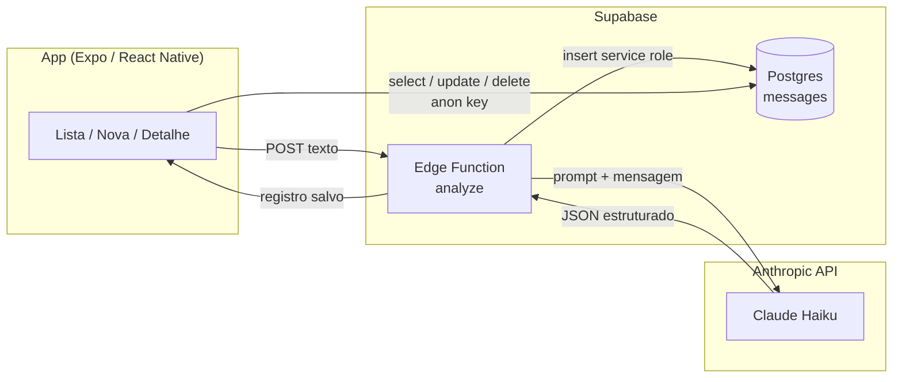

# ZapCheck

## O que é o app

O **ZapCheck** é um app mobile para profissionais autônomos que colam mensagens recebidas (estilo WhatsApp), enviam para análise por IA e visualizam os dados estruturados em uma lista organizada — com categoria, urgência, resumo e ações de follow-up.

Você filtra por tipo e prioridade, abre o detalhe de cada mensagem e marca como atendida ou remove registros antigos.

---

## Stack escolhida (com justificativa)

| Camada | Tecnologia | Por quê |
|--------|------------|---------|
| **Mobile** | React Native + **Expo SDK 54** | Desenvolvimento rápido, hot reload, sem build nativo no dia a dia; ecossistema maduro para publicar depois |
| **Navegação** | **Expo Router** | Rotas baseadas em arquivos (`app/`), alinhado ao padrão Next.js, tipagem de rotas e deep linking |
| **Estilo** | **NativeWind** (Tailwind) | Utilitários CSS familiares, UI consistente com menos StyleSheet manual |
| **Backend** | **Supabase Edge Functions** (Deno) | Serverless na mesma plataforma do banco; API key da Anthropic fica só no servidor |
| **Banco** | **Supabase Postgres** | SQL relacional, cliente JS pronto, RLS quando for endurecer segurança |
| **IA** | **Claude** (`claude-haiku-4-5`) | Modelo rápido e econômico para extração estruturada de JSON a partir de texto livre |

**TypeScript** em todo o fluxo (app + Edge Function) para contratos claros entre telas, tipos e API.

---

## Diagrama de arquitetura



**Fluxo resumido**

1. Usuário cola o texto em **Nova mensagem** → app chama a Edge Function `analyze`.
2. A function chama a **API da Anthropic**, faz parse do JSON e **salva** em `messages` com a service role.
3. A **lista** e o **detalhe** leem/atualizam o Supabase diretamente com a chave anônima (RLS configurável).

---

## Como rodar localmente

### Pré-requisitos

- [Node.js](https://nodejs.org/) 20+ (LTS recomendado)
- Conta no [Supabase](https://supabase.com/) com projeto criado
- Conta na [Anthropic](https://console.anthropic.com/) com API key
- [Supabase CLI](https://supabase.com/docs/guides/cli) (para deploy da Edge Function)
- App **Expo Go** no celular (iOS ou Android)

### 1. Clonar e instalar

```bash
git clone https://github.com/theuxz/zapcheck
cd zapcheck
npm install
```

### 2. Banco de dados (Supabase)

No **SQL Editor** do painel Supabase, execute o script:

`supabase/migrations/001_create_messages.sql`

Isso cria a tabela `messages` com todos os campos necessários.

### 3. Edge Function

```bash
supabase link --project-ref <seu-project-ref>
supabase functions deploy analyze
```

Configure os secrets:

```bash
supabase secrets set ANTHROPIC_API_KEY=<sua-chave-anthropic>
supabase secrets set SUPABASE_URL=<url-do-projeto>
supabase secrets set SUPABASE_SERVICE_ROLE_KEY=<service-role-key>
```

Na aba **Settings** da Edge Function no painel Supabase, desative **"Verify JWT with legacy secret"**.

### 4. Variáveis de ambiente do app

```bash
cp .env.example .env
```

Preencha o `.env` com os valores reais (veja seção abaixo).

### 5. Rodar

```bash
npx expo start --clear
```

---

## Como rodar o app sem buildar (Expo Go)

1. Instale **Expo Go** na App Store ou Google Play.
2. Na pasta do projeto: `npx expo start`.
3. Escaneie o **QR code** exibido no terminal com a câmera do iPhone ou com o Expo Go no Android.
4. Celular e PC devem estar na **mesma rede Wi‑Fi**.

---

## Como usei IA generativa

| Ferramenta | Uso |
|------------|-----|
| **Claude (claude.ai)** | Planejamento da arquitetura, geração do prompt de análise, diagnóstico de erros, aprendizado das tecnologias |
| **Cursor** | Geração da estrutura completa do projeto (telas, componentes, Edge Function, tipos, configurações) |

### Contexto importante

Este foi meu primeiro contato com React Native, Expo, Supabase e APIs de IA. Nunca havia usado nenhuma dessas tecnologias antes. Usei IA como ferramenta de aprendizado e construção ao mesmo tempo — não para substituir o entendimento, mas para acelerar o processo enquanto aprendia o que cada parte fazia.

### Como o processo funcionou na prática

**1. Antes de escrever qualquer código**, usei o Claude para estruturar um prompt detalhado descrevendo toda a arquitetura: stack, estrutura de pastas, modelo de dados SQL, contrato da Edge Function e comportamento das três telas. Esse prompt foi colado no Cursor para gerar a base do projeto.

**2. Durante o desenvolvimento**, usei o Claude para:
- Entender o que cada arquivo gerado fazia
- Diagnosticar erros (como o modelo incorreto da API Anthropic e o erro 401 de autenticação)
- Aprender o que são Edge Functions, secrets, anon key, JWT

**3. O prompt fixo de análise**, enviado pela Edge Function a cada mensagem:

```text
Você é um assistente de análise de mensagens de WhatsApp para profissionais autônomos.
Analise a mensagem abaixo e retorne APENAS um objeto JSON válido, sem explicações, sem markdown, sem texto extra.

Campos obrigatórios do JSON:
- nome: string com o nome do remetente, ou null se não identificado
- telefone: string com o telefone, ou null se não mencionado
- categoria: exatamente um de: "novo_cliente", "pedido", "cobranca", "suporte", "outros"
- intencao: string curta descrevendo o que a pessoa quer
- valor_mencionado: número em BRL ou null se não mencionado
- urgencia: exatamente um de: "alta", "media", "baixa"
- precisa_followup: boolean indicando se precisa de resposta
- resumo: string de 1 a 2 frases resumindo a mensagem

Mensagem:
{{TEXTO}}
```

### Onde rejeitei sugestões da IA

- O Cursor sugeriu uma URL incorreta para a Edge Function no `.env` — corrigi manualmente
- O modelo inicial gerado (`claude-3-5-haiku-20241022`) não existia mais na API — identifiquei pelo log de erro e corrigi para `claude-haiku-4-5`
- A autenticação JWT da Edge Function precisou ser desativada manualmente no painel — a IA não antecipou isso

---

## Decisões técnicas e por quê

| Decisão | Motivo |
|---------|--------|
| **Edge Function como único ponto com API key da Anthropic** | Chave nunca no bundle do app; reduz risco de vazamento |
| **Insert via `SUPABASE_SERVICE_ROLE_KEY` na function** | Garante gravação mesmo com RLS restritivo no futuro |
| **App lê/escreve Supabase direto (lista/detalhe)** | Menos latência para CRUD simples |
| **`claude-haiku-4-5`** | Custo e latência menores para extração estruturada |
| **Expo Router file-based** | Rotas previsíveis: `/`, `/nova`, `/[id]` |
| **NativeWind** | Produtividade de UI com padrão Tailwind |
| **Sem AsyncStorage** | Fonte única de verdade no Postgres; evita dessincronia |
| **JWT verification desativado na Edge Function** | A anon key do Supabase no novo formato não satisfaz o legacy JWT — solução pragmática para MVP |

---

## O que ficou para depois

- [ ] Autenticação de usuários (Supabase Auth) e RLS por conta
- [ ] Integração real com WhatsApp (API Business / webhook)
- [ ] Notificações push para mensagens de urgência `alta`
- [ ] Busca full-text e paginação na lista
- [ ] Testes automatizados
- [ ] Build de produção com EAS e publicação nas lojas
- [ ] Rate limiting e validação de schema na Edge Function

---

## Tempo investido

| Sessão | Período | Duração |
|--------|---------|---------|
| 1ª sessão | 16h00 – 18h30 | 2h30 |
| 2ª sessão | 19h00 – 21h00 | 2h00 |
| 3ª sessão | 01h00 – 02h30 | 1h30 |
| **Total** | | **~6 horas** |

---

## Variáveis de ambiente

### App (arquivo `.env` na raiz — não versionar)

| Variável | Descrição |
|----------|-----------|
| `EXPO_PUBLIC_SUPABASE_URL` | URL do projeto Supabase |
| `EXPO_PUBLIC_SUPABASE_ANON_KEY` | Chave pública (anon) do Supabase |
| `EXPO_PUBLIC_ANALYZE_FUNCTION_URL` | URL completa da Edge Function `analyze` |

### Supabase (secrets da Edge Function)

| Variável | Descrição |
|----------|-----------|
| `ANTHROPIC_API_KEY` | Chave da API Anthropic |
| `SUPABASE_URL` | URL do projeto |
| `SUPABASE_SERVICE_ROLE_KEY` | Service role (somente backend; nunca no app) |

```env
EXPO_PUBLIC_SUPABASE_URL=
EXPO_PUBLIC_SUPABASE_ANON_KEY=
EXPO_PUBLIC_ANALYZE_FUNCTION_URL=
```

---

## Estrutura do projeto

```
zapcheck/
├── app/
│   ├── _layout.tsx
│   ├── index.tsx           # Lista
│   ├── nova.tsx            # Nova mensagem
│   └── [id].tsx            # Detalhe
├── components/
├── lib/supabase.ts
├── types/message.ts
├── supabase/
│   ├── functions/analyze/
│   └── migrations/
├── .env.example
└── README.md
```

---

## Scripts úteis

| Comando | Ação |
|---------|------|
| `npx expo start --clear` | Inicia limpando cache |
| `npx expo start --tunnel` | QR code via túnel (redes restritivas) |
| `supabase functions deploy analyze` | Publica a Edge Function |