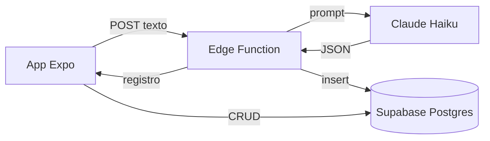

# ZapCheck — Prova Prática

## O que é

O ZapCheck é um app mobile para profissionais autônomos que colam mensagens recebidas (estilo WhatsApp), enviam para análise por IA e visualizam os dados estruturados em uma lista organizada — com categoria, urgência, resumo e ações de follow-up. Você filtra por tipo e prioridade, abre o detalhe de cada mensagem e marca como atendida ou remove registros antigos.

---

## Stack escolhida

| Camada | Tecnologia | Por quê |
| --- | --- | --- |
| **Mobile** | React Native + Expo SDK 54 | Desenvolvimento rápido, hot reload, sem build nativo no dia a dia; ecossistema maduro para publicar depois. |
| **Navegação** | Expo Router | Rotas baseadas em arquivos (`app/`), alinhado ao padrão Next.js, tipagem de rotas e deep linking. |
| **Estilo** | NativeWind (Tailwind) | Utilitários CSS familiares, UI consistente com menos StyleSheet manual. |
| **Backend** | Supabase Edge Functions (Deno) | Serverless na mesma plataforma do banco; API key da Anthropic fica só no servidor. |
| **Banco** | Supabase Postgres | SQL relacional, cliente JS pronto, RLS quando for endurecer segurança. |
| **IA** | Claude (claude-haiku-4-5) | Modelo rápido e econômico para extração estruturada de JSON a partir de texto livre. |

> **Nota:** Utilizado TypeScript em todo o fluxo (app + Edge Function) para garantir contratos claros entre telas, tipos e API.

---

## Arquitetura



### Fluxo resumido

1. Usuário cola o texto em *Nova mensagem* → app chama a Edge Function `analyze`.
2. A function chama a API da Anthropic, faz parse do JSON e salva em `messages` com a `service role`.
3. A lista e o detalhe leem/atualizam o Supabase diretamente com a chave anônima (RLS configurável).

---

## Como rodar localmente

### Pré-requisitos

* Node.js 20+ (LTS recomendado)
* Conta no Supabase com projeto criado
* Conta na Anthropic com API key
* Supabase CLI (para deploy da Edge Function)
* App Expo Go no celular (iOS ou Android)

### 1. Clonar e instalar

```bash
git clone https://github.com/theuxz/zapcheck
cd zapcheck
npm install --legacy-peer-deps

```

### 2. Banco de dados (Supabase)

No **SQL Editor** do painel do Supabase, execute o script contido em:
`supabase/migrations/001_create_messages.sql`
*Isso criará a tabela `messages` com todos os campos necessários.*

### 3. Edge Function

```bash
supabase link --project-ref <seu-project-ref>
supabase functions deploy analyze

```

Configure os secrets no Supabase:

```bash
supabase secrets set ANTHROPIC_API_KEY=<sua-chave-anthropic>
supabase secrets set SUPABASE_URL=<url-do-projeto>
supabase secrets set SUPABASE_SERVICE_ROLE_KEY=<service-role-key>

```

*Na aba **Settings** da Edge Function no painel do Supabase, desative a opção "Verify JWT with legacy secret".*

### 4. Variáveis de ambiente do app

```bash
cp .env.example .env

```

Preencha o arquivo `.env` com os valores reais conforme a seção de Variáveis de Ambiente abaixo.

### 5. Rodar

```bash
npx expo start --clear

```

---

## Como rodar o app sem buildar

Instale o app **Expo Go** na App Store ou Google Play.

### Opção 1: Link permanente (Não precisa do PC ligado)

Acesse o link direto do deploy pelo seu celular:
[https://expo.dev/accounts/theuxz/projects/zapcheck/updates/69c700b7-f584-4d29-bced-058129d81aac](https://expo.dev/accounts/theuxz/projects/zapcheck/updates/69c700b7-f584-4d29-bced-058129d81aac)

### Opção 2: Pela mesma rede Wi-Fi

Rode localmente com `npx expo start` e escaneie o QR code gerado no terminal.

### Opção 3: Em redes separadas (Sem Wi-Fi comum)

Rode o comando usando o túnel do Expo:

```bash
npx expo start --tunnel

```

---

## Como usei IA generativa

### Ferramentas Utilizadas

* **Claude (claude.ai):** Planejamento da arquitetura, geração do prompt de análise, diagnóstico de erros e aprendizado das tecnologias.
* **Cursor:** Geração da estrutura completa do projeto (telas, componentes, Edge Function, tipos e configurações).

### Contexto importante

Este foi meu primeiro contato com React Native, Expo, Supabase e APIs de IA. Nunca havia usado nenhuma dessas tecnologias antes. Usei a IA como ferramenta de aprendizado e construção ao mesmo tempo — não para substituir o entendimento, mas para acelerar o processo enquanto aprendia o que cada parte fazia.

### Como o processo funcionou na prática

1. **Antes do código:** Usei o Claude para estruturar um prompt detalhado descrevendo toda a arquitetura: stack, estrutura de pastas, modelo de dados SQL, contrato da Edge Function e comportamento das três telas. Esse prompt foi colado no Cursor para gerar a base do projeto.
2. **Durante o desenvolvimento:** Usei o Claude para entender o que cada arquivo gerado fazia, diagnosticar erros (como o modelo incorreto da API Anthropic e o erro 401 de autenticação) e aprender conceitos como Edge Functions, secrets, anon key e JWT.

### Exemplo de Prompt (Fixo na Edge Function)

```text
Você é um assistente de análise de mensagens de WhatsApp para profissionais autônomos.
Analise a mensagem abaixo e retorne APENAS um objeto JSON válido, sem explicações, sem markdown, sem texto extra.

Campos obrigatórios do JSON:
- nome: string com o nome do remetente, ou null se não identificado
- telefone: string com o telefone, ou null se não mencionado
- categoria: exatamente um de: "novo_cliente", "pedido", "cobranca", "suporte", "outros"
- intencao: string curta descrevendo o que a pessoa quer
- valor_mencionado: número em BRL ou null se não mencionado
- urgencia: exatamente um de: "alta", "media", "baixa"
- precisa_followup: boolean indicando se precisa de resposta
- resumo: string de 1 a 2 frases resumindo a mensagem

Mensagem:
{{TEXTO}}

```

### Onde rejeitei sugestões da IA

* O Cursor sugeriu uma URL incorreta para a Edge Function no `.env` — corrigi manualmente.
* O modelo inicial gerado pela IA (`claude-3-5-haiku-20241022`) não existia mais na API — identifiquei pelo log de erro e corrigi para `claude-haiku-4-5`.
* A autenticação JWT da Edge Function precisou ser desativada manualmente no painel do Supabase — a IA não antecipou esse conflito de chaves.
* O downgrade do `@supabase/supabase-js` para `2.39.0` foi necessário para compatibilidade com o motor Hermes do React Native — identificado e resolvido manualmente após falha na sugestão inicial da IA.

---

## Decisões técnicas

* **Edge Function como único ponto com API key da Anthropic:** Mantém a chave segura no backend, reduzindo risco de vazamento no bundle do app.
* **Insert via `SUPABASE_SERVICE_ROLE_KEY` na function:** Garante a gravação dos dados de forma robusta, mesmo se regras RLS mais restritivas forem aplicadas no futuro.
* **App lê/escreve Supabase direto (lista/detalhe):** Menos latência e menor complexidade para operações de CRUD simples que não passam por IA.
* **Modelo `claude-haiku-4-5`:** Escolha pragmática focando no menor custo e menor latência para extração estruturada de JSON.
* **Expo Router file-based:** Garante rotas previsíveis e limpas (`/`, `/nova`, `/[id]`).
* **NativeWind:** Ganho drástico de produtividade na UI utilizando o padrão utilitário do Tailwind.
* **Sem AsyncStorage:** Mantive o Postgres como fonte única da verdade para evitar dessincronização de estados locais.
* **JWT verification desativado na Edge Function:** A anon key do Supabase no novo formato gerava incompatibilidade com o legacy JWT. Desativar foi a solução mais pragmática para o MVP.
* **Downgrade do `@supabase/supabase-js` para v2.39.0:** Versões mais recentes usam `import()` dinâmico, que quebra no motor Hermes do React Native. O downgrade resolveu sem impactos funcionais.

---

## O que ficou para depois

* `[ ]` Autenticação de usuários (Supabase Auth) e isolamento de RLS por conta.
* `[ ]` Integração real com o WhatsApp (via API Business ou Webhook oficial).
* `[ ]` Notificações push em tempo real para mensagens marcadas com urgência alta.
* `[ ]` Busca full-text e paginação com infinite scroll na lista de mensagens.
* `[ ]` Criação de testes automatizados (unitários e de integração).
* `[ ]` Build de produção estruturado via EAS e publicação oficial nas lojas (App Store / Google Play).
* `[ ]` Camada de Rate limiting e validação rigorosa de schema (Zod) na Edge Function.

---

## Tempo investido

Uma estimativa honesta do tempo total dedicado ao projeto:

| Sessão | Período | Duração |
| --- | --- | --- |
| 1ª sessão | 16h00 – 18h30 | 2h30 |
| 2ª sessão | 19h00 – 21h00 | 2h00 |
| 3ª sessão | 01h00 – 02h30 | 1h30 |
| 4ª sessão | 03h00 – 04h00 | 1h00 |
| **Total** |  | **~7 horas** |

---

## Variáveis de ambiente

### No App (Arquivo `.env` na raiz — nunca versionar)

| Variável | Descrição |
| --- | --- |
| `EXPO_PUBLIC_SUPABASE_URL` | URL base do seu projeto Supabase |
| `EXPO_PUBLIC_SUPABASE_ANON_KEY` | Chave pública anônima do Supabase |
| `EXPO_PUBLIC_ANALYZE_FUNCTION_URL` | URL completa de chamada para a Edge Function `analyze` |

### No Supabase (Configuradas via CLI Secrets)

| Variável | Descrição |
| --- | --- |
| `ANTHROPIC_API_KEY` | Chave privada de acesso à API da Anthropic (Claude) |
| `SUPABASE_URL` | URL interna do projeto Supabase |
| `SUPABASE_SERVICE_ROLE_KEY` | Chave administrativa (Service Role) para bypass de RLS no banco |

Exemplo de estrutura do arquivo `.env`:

```env
EXPO_PUBLIC_SUPABASE_URL=
EXPO_PUBLIC_SUPABASE_ANON_KEY=
EXPO_PUBLIC_ANALYZE_FUNCTION_URL=

```

---

## Estrutura do projeto

```text
zapcheck/
├── app/
│   ├── _layout.tsx
│   ├── index.tsx           # Lista principal
│   ├── nova.tsx            # Tela de captura de nova mensagem
│   └── [id].tsx            # Detalhes da mensagem estruturada
├── components/             # Componentes reutilizáveis de UI
├── lib/supabase.ts         # Inicialização do cliente Supabase
├── types/message.ts        # Definições de tipos TypeScript
├── supabase/
│   ├── functions/analyze/  # Código Deno da Edge Function
│   └── migrations/         # Scripts de migração SQL do banco
├── .env.example
└── README.md

```

## Scripts úteis

| Comando | Ação |
| --- | --- |
| `npx expo start --clear` | Inicia o servidor local limpando o cache do Metro Bundler. |
| `npx expo start --tunnel` | Gera o QR Code exposto via túnel (útil para redes Wi-Fi separadas). |
| `supabase functions deploy analyze` | Publica as alterações locais da Edge Function diretamente no Supabase. |
| `eas update --branch main --message "..."` | Publica uma atualização de código diretamente via OTA (Over-The-Air) no EAS. |